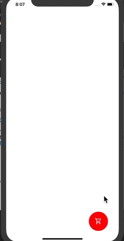

# Animated Floating Action Button (FAB)
An exploration of React Native Animated API using a very basic example.
This shows how several interpolations can be carried out over a single Animated.Value() in
React Native.

## How to run
- Pull the repo
- Install dependencies using `yarn`.
- Run using `expo start`.

Enjoy :) 
